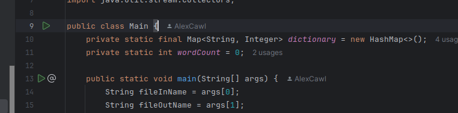
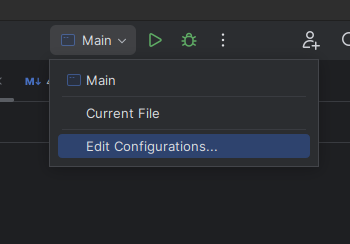
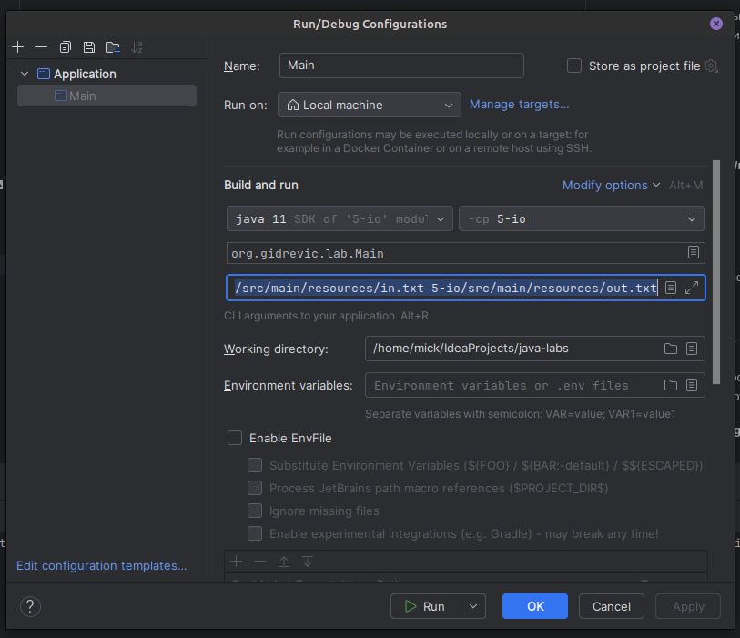
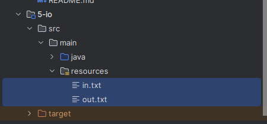

# Задание

Написать функциональный интерфейс с методом, который принимает две строки и возвращает тоже строку. Написать реализацию
такого интерфейса в виде лямбды, которая возвращает ту строку, которая длиннее.

# Решение

Смотри **4-lambdas/src/main/java/org/gidrevic/lab/Main.java**

# Запуск

Нажимаешь на зеленую кнопку **Run**

И программа вылетает с ошибкой! Сейчас исправим.

При первом запуске программы у тебя автоматически создается конфигурация для запуска. По сути это удобный интерфейс,
который вызывает java и запускает твою программу.

Нажимаешь **Edit configurations**

Необходимо указать передаваемые аргументы в программу (через пробел). Которые потом можно достать из String [] args.

Я указал как:
> **5-io/src/main/resources/in.txt 5-io/src/main/resources/out.csv**

Потому что файлы лежат в папке **resources**

Можешь в параметры указывать любой абсолютный путь до файла.
