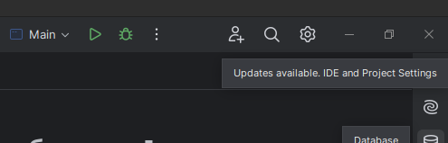
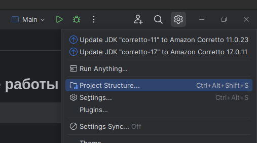
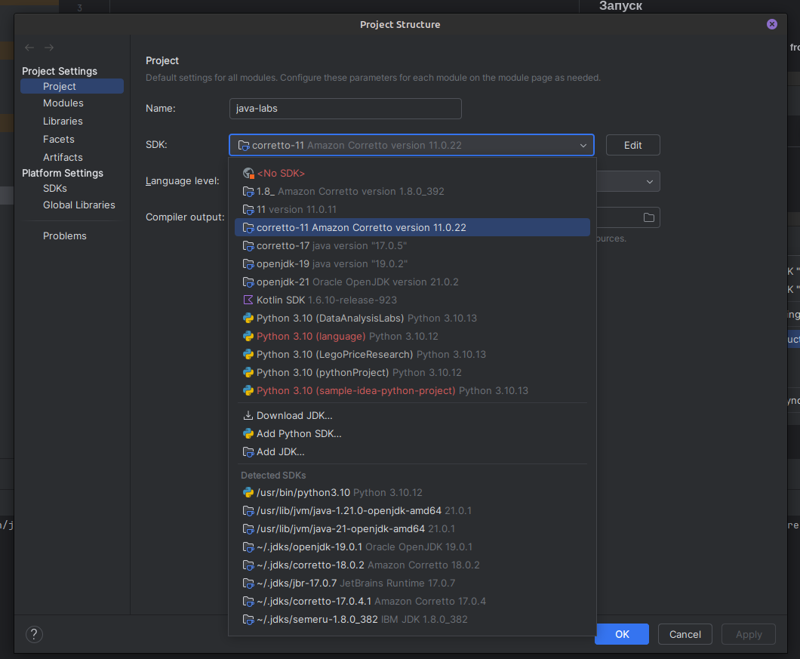
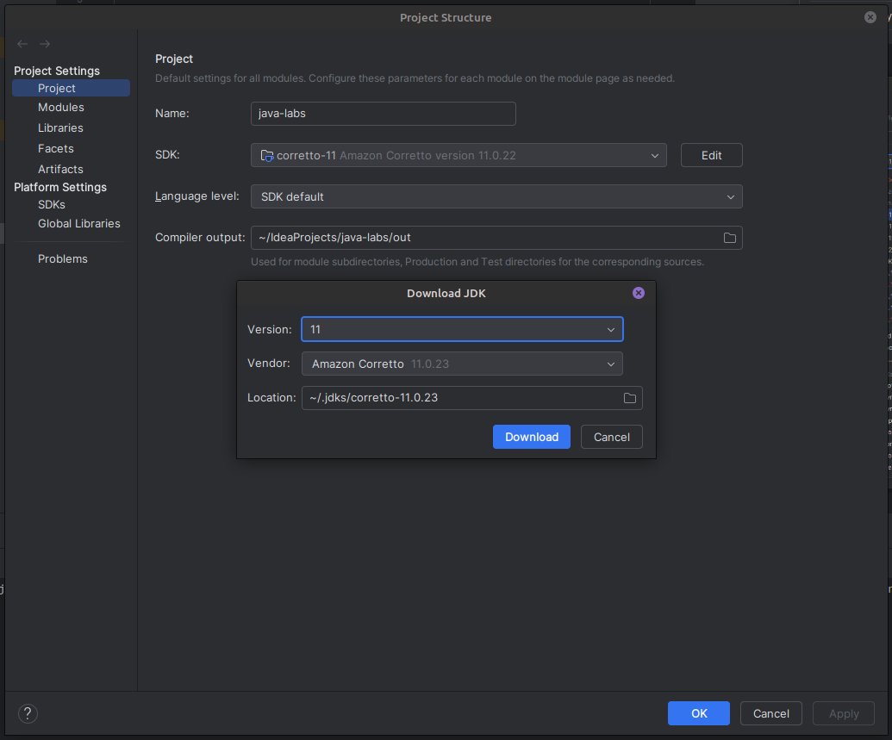

# Практические работы по Java

> Вариант №5

### Запуск

1. Скачиваем Jetbrains Intellij IDEA
2. Скачиваем этот проект с GitHub (**Get from VCS** в project wizard)
3. Нажимаем на настройки **IDE and Project Settings**
   

4. Нажимаем на **Project Structure**
   

5. Выбираем версию Java 11
   

6. Если этой версии нет, то нажимаем **Download JDK**
7. Выставляем как на рисунке и выбираем **Download**
   

8. Выбираем в списке SDK и нажимаем **OK**

